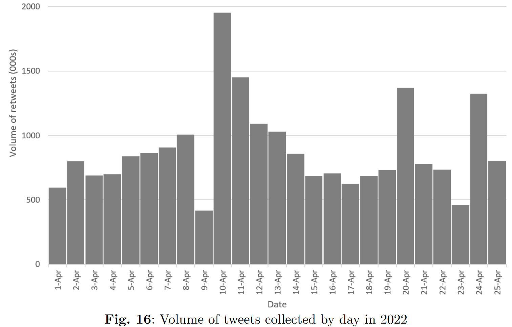
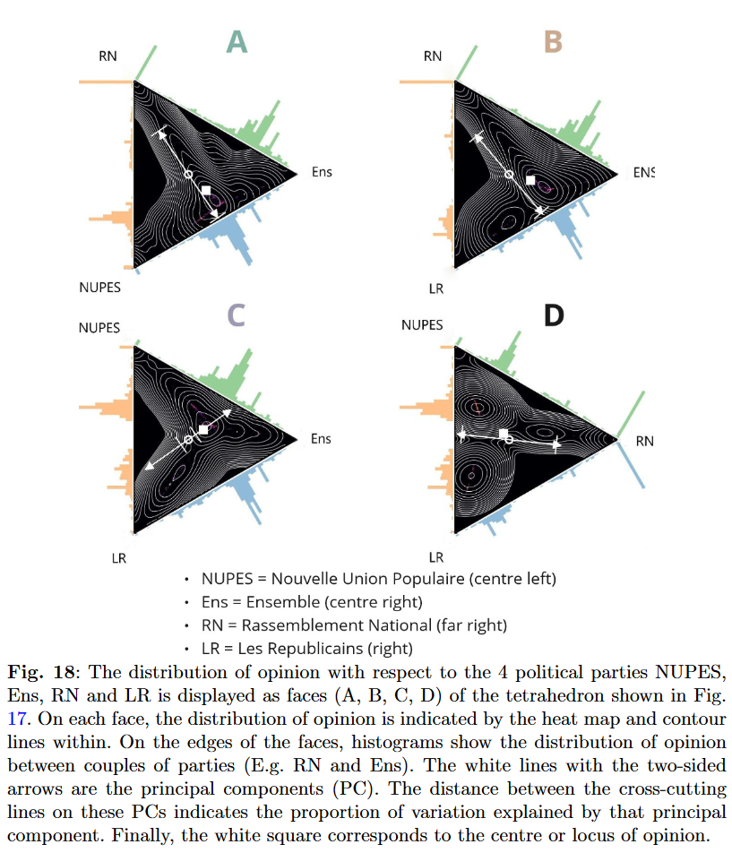

# (Master's Thesis) Quantifying political polarisation online
**by Oliver Norton**

Full title: Measuring Mass Ideological Polarisation in Multiparty Political Systems: Application in the French Context

### Goal:
To measure polarisation online during the 2022 French general elections using data from Twitter/X, and a recently developed measure of polarisation for multiparty political systems.

### Tools developed:
Python, UCloud, Git, LaTeX, NetworkX, Gephi

### Skills developed:
- Network analysis
- data wrangling
- machine learning
- natural language processing (NLP)
- complex systems
- graph theory
- cloud computing
- building machine learning models 
- managing virtual machines (VM, VMs)

### Overview

In this repository, you can read the code used for my master's thesis. Sensitive information has been removed. The code is a combination of my own work and tools from:

Martin-Gutierrez, S., Losada, J. C., & Benito, R. M. (2023). Multipolar social systems: Measuring polarization beyond dichotomous contexts. *Chaos, Solitons & Fractals, 169*, 113244.

While the thesis is not publicly available, this code and README will help explain the processes involved, from data collection to analysis. Since a lot of code has been removed, not all file names correspond to exactly what are in the scripts. 

To begin, there is a summary below, of the context of my thesis. Afterwards, I go into the details of the approach, and the results.

<strong>Summary of master's thesis</strong>

Political polarisation can have negative impacts on democracy, such as legislative grid-
lock, hate or dislike for other groups in society, and can result in less choice for voters.
Political science researchers have therefore sought to measure political polarisation
among the public. However, many of these measures of polarisation originate in two-
party systems, making them unsuitable for some multiparty systems. In particular,
survey-based measures assume that there is ideological constraint in a political system,
i.e. that you can predict someone’s stance on an issue based on their left-right ideology.
This assumption implies that opinion in that system is uni-dimensional, yet opinion in
some multiparty systems is multi-dimensional. In my thesis, I utilise a newly developed
measure of mass ideological polarisation that accounts for the multi-dimensionality of
opinion in multiparty systems. Firstly, this method infers the ideology of individuals
based on which politicians and political parties they retweet on Twitter. Secondly,
it measures ideological polarisation among all individuals using a multi-dimensional
measure of variance, called total variation. I apply this method to the case of the
Twitter debate surrounding the 2022 French presidential elections. My results show
that ideology among the French online public is only slightly polarised overall, how-
ever, the supporters of the far-right political party Rassemblement National hold more
extreme opinions compared to the supporters of the other parties. In addition, I find
that the method of measuring polarisation is not sensitive to the choice of politicians,
from which ideology is inferred, but is sensitive to how politically engaged or active
members of the public are. These findings support the commonly held notion that
highly politically engaged people online, and among the electorate, hold more extreme
opinions.

<strong>Step 1: Data Collection</strong>

Twitter data is collected from a proprietary API over a few days. Data is collected by minute, hour, and day according to the API's rate limit. The enriched Tweet data (including Twitter handle, time, text, retweets, etc.) is stored in pickle files.

The data comes from an analytics platform using a saved query of keywords with boolean operators. For example, a query about US politics might be:

`("donald trump" OR "trump" OR "elections") AND ("2024" OR "2023" OR "US" OR "United States")`

Twitter posts containing these keywords and fulfilling set parameters (e.g., Tweet created between 2023-10-10 and 2023-10-11) are collected.

<strong>Step 2: Data Processing</strong>

The collected data contains redundant information, so excess columns are removed. The smaller pickle files are stored separately and then combined into a single file.

<strong>Step 3: Keyword Expansion</strong>

Initially, a limited list of keywords is used based on field knowledge. However, for the thesis, a more comprehensive list is needed. We use 'keyword expansion', an NLP technique that assesses co-occurrence and contextual similarity of words, based on:

King, G., Lam, P., & Roberts, M. E. (2017). Computer-assisted keyword and document set discovery from unstructured text. *American Journal of Political Science, 61*(4), 971–988.

This approach helps identify additional keywords for searching Tweets. Steps 1, 2, and 3 are repeated until a suitable dataset is obtained.

<strong>Step 4: Results and Analysis</strong>

Initial analysis involves collecting basic descriptive statistics and identifying/filtering 'opinion leaders' or elite actors whose Tweets are influential in the dataset and the context of the French elections. The main analysis uses this dataset and these elite actors to measure political polarisation between political parties during the 2022 French elections.

