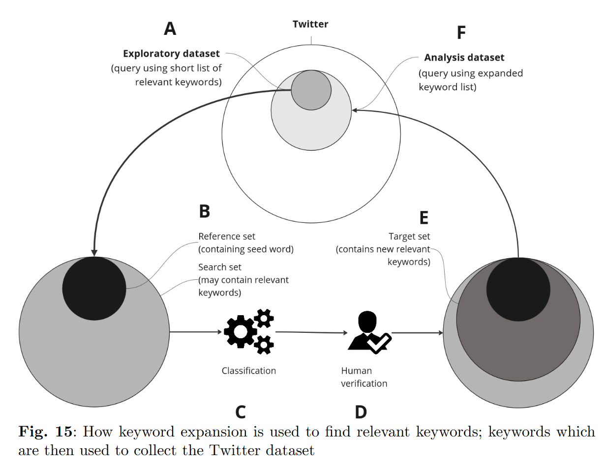
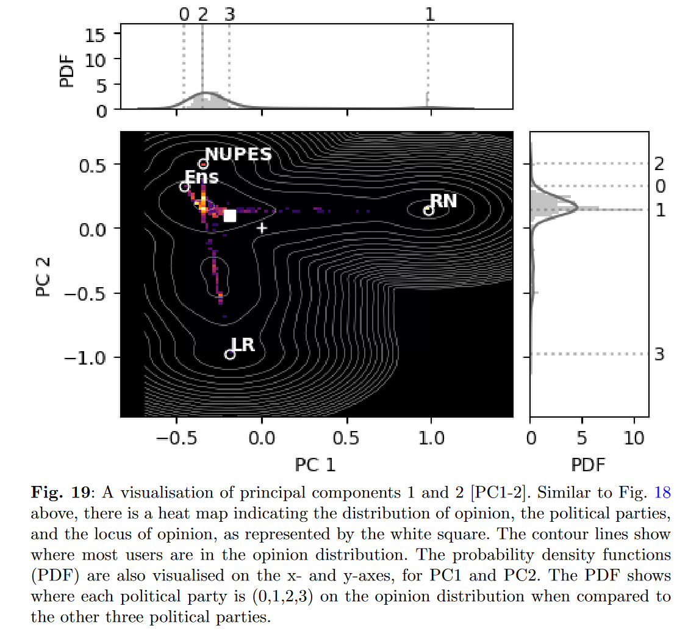

# Master's Thesis: Measuring Mass Ideological Polarisation in Multiparty Political Systems: Application in the French Context
**by Oliver Norton**

In this repository, you can read the code used for my master's thesis. Sensitive information has been removed. The code is a combination of my own work and tools from:

Martin-Gutierrez, S., Losada, J. C., & Benito, R. M. (2023). Multipolar social systems: Measuring polarization beyond dichotomous contexts. *Chaos, Solitons & Fractals, 169*, 113244.

While the thesis is not publicly available, this code and README will help explain the processes involved, from data collection to analysis. Since a lot of code has been removed, not all file names correspond to exactly what are in the scripts. 

<strong>Step 1: Data Collection</strong>

Twitter data is collected from a proprietary API over a few days. Data is collected by minute, hour, and day according to the API's rate limit. The enriched Tweet data (including Twitter handle, time, text, retweets, etc.) is stored in pickle files.

The data comes from an analytics platform using a saved query of keywords with boolean operators. For example, a query about US politics might be:

`("donald trump" OR "trump" OR "elections") AND ("2024" OR "2023" OR "US" OR "United States")`

Twitter posts containing these keywords and fulfilling set parameters (e.g., Tweet created between 2023-10-10 and 2023-10-11) are collected.

<strong>Step 2: Data Processing</strong>

The collected data contains redundant information, so excess columns are removed. The smaller pickle files are stored separately and then combined into a single file.

<strong>Step 3: Keyword Expansion</strong>

Initially, a limited list of keywords is used based on field knowledge. However, for the thesis, a more comprehensive list is needed. We use 'keyword expansion', an NLP technique that assesses co-occurrence and contextual similarity of words, based on:

King, G., Lam, P., & Roberts, M. E. (2017). Computer-assisted keyword and document set discovery from unstructured text. *American Journal of Political Science, 61*(4), 971–988.

This approach helps identify additional keywords for searching Tweets. Steps 1, 2, and 3 are repeated until a suitable dataset is obtained.

<strong>Step 4: Analysis</strong>

Initial analysis involves collecting basic descriptive statistics and identifying/filtering 'opinion leaders' or elite actors whose Tweets are influential in the dataset and the context of the French elections. The main analysis uses this dataset and these elite actors to measure political polarisation between political parties during the 2022 French elections.

